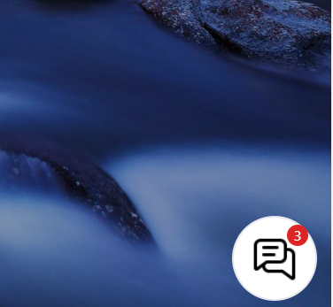
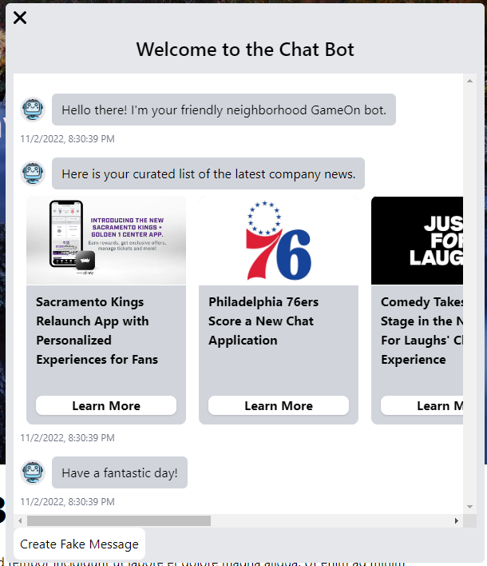
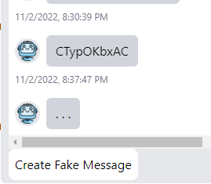

# Take Home Assessment
## [LIVE LINK](https://chatbot-ndias.netlify.app/)

## User Instructions
If you would like to run this on your machine, I have hosted it on Netlify so no downloading necessary! If you want to look at my code, you can either look here on GitHub or you can look at the zip file I sent you. If you would like to run the code on your machine, make sure to run these commands:

`npm install`

AND THEN

`npm start`

## Objective
Your task is to implement a chat renderer!

You will receive a simluated message object via our mock API class. Your task is to take this message and render it in the main element in this file.

## Completion
The instructions mentioned I was allowed to use a framework so I am using React and TailwindCSS to complete this project. The over achiever in me created a fake landing page with a fixed positioned chat box. Initially, you will have 3 unread messages which is shown with a number on the top right of the chat bubble.

When you view the messages, they will be marked as read and that number will disappear. The three initial messages are from the given "API" and are styled to fit the given design reference. 

I also added a button that generates a fake message from the bot which is picked randomly from a list of around 100 strings courtesy of Random.org. When you click the button, it will return a JS Promise which calls the function that chooses the random string in a random amount of time, the chat box will have three dots to signify that the bot is thinking.

